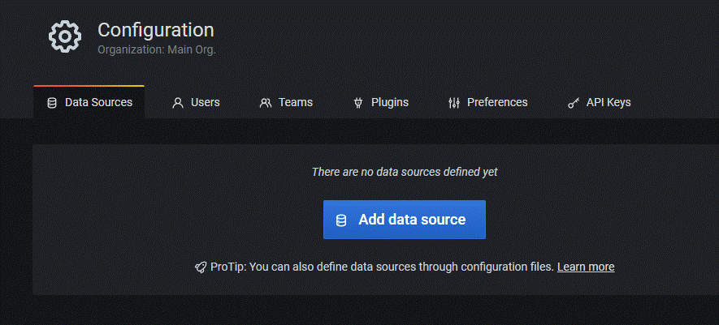
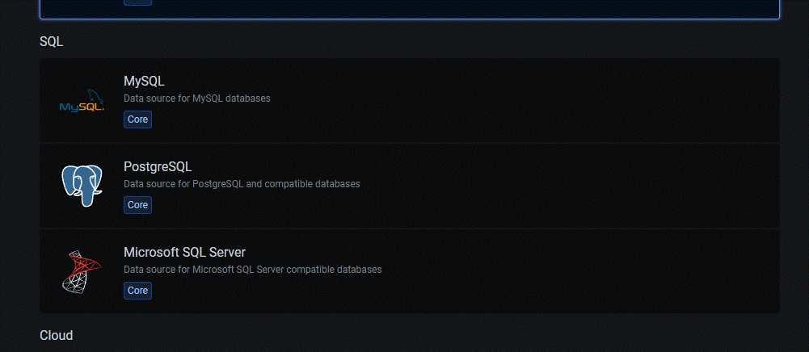
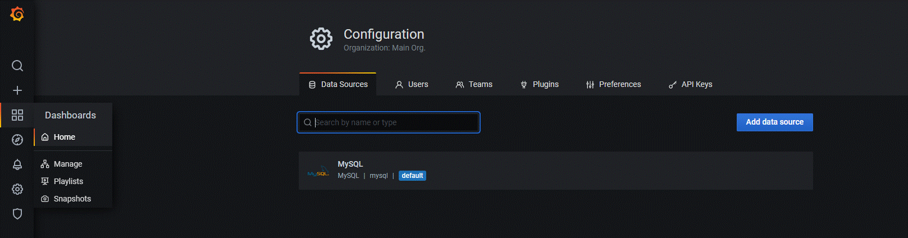
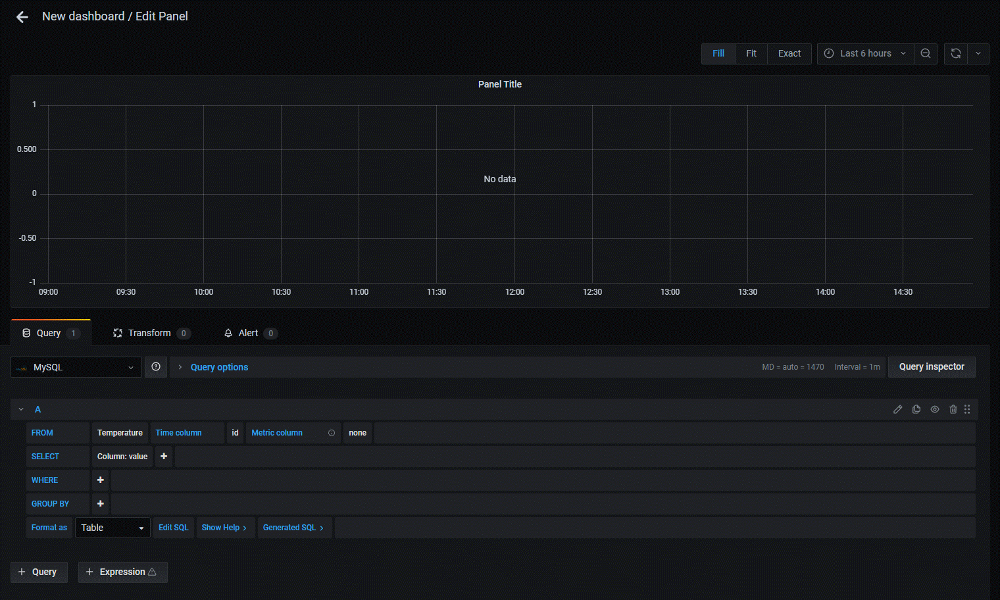
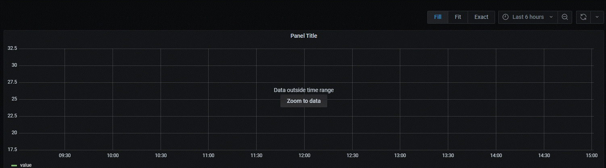

# AirLux

AirLux est une application de domotique avec une architecture complète permettant
à un utilisateur de se connecter, gérer ses appareils et accéder aux différentes
données liées à la température ou à l'humidité par exemple.


## Authors

- [@AlexisB](https://www.github.com/alexibrouard)
- [@JeremyLR](https://github.com/JeremyLRYnov)
- [@JérémyG](https://github.com/Zetsuy)
- [@EnzoP](https://github.com/DaoGod)
- [@NicolasS](https://github.com/Nicolas-3050)

## Mise en place de Grafana

Tout d'abord, pour que Grafana marche, il faut lui crée un conteneur.
Nous avons décidé d'utiliser Mysql comme base de données pour se connecter à Grafana. Pour ce faire, dans le docker compose, nous avons spécifié dans son environnement les paramètres de la db Mysql.

A la suite de ça, il faut lancer les conteneurs avec la commande :

```$ docker-compose up -d```

Quand tout les conteneurs sont en marche et surtout celui de Grafana, on ouvre un navigateur et on écrit **localhost:3000** et on arrive devant une page de connexion de Grafana où on rentre les identifiants : 

User : **seillenicolas**

Password : **OAsm,5j9.nico**

Comme expliqué précedement, Grafana à besoin d'une source de données. Pour cela, il faut rajouter des données dans la base données.

### Ajout de données dans Mysql

Pour ajouter des donnnées, il faut crée les Tables de données dans Mysql.

Donc il faut aller dans le conteneur appmysql, allez à son terminal et écrire la commande :

```$ node server.js```

Ensuite, il faut allez dans le conteneur de Mysql. Dans ce conteneur, dans le terminal, on se connecte à mysql avec la commande : 

```$ mysql -h mysql -u root -p123456```  

ou

```$ mysql -u root -p```

Cela va ensuite vous demandez de rentrer le mot de passe.

A la suite de ça, on sera connecter à Mysql, cependant, il faut se connecter à la bonne base de données qui est **distant_db** mais il faut vérifier qu'elle existe en utilisant la commande :

```$ SHOW databases;```

Ensuite on se connecte :

```$ USE distant_db;```

Pour ajouter des données dans la base : 

```$ INSERT INTO Temperature VALUES(1,20);```

Cela va ajouter la valeur de 20 avec l'id 1 dans la table Temperature.

Pour vérifier les valeurs dans la table : 

```$ SELECT * FROM Temperature;```

### Utilisation de Grafana avec les données

A la suite de l'ajout de données dans la db et de la connexion à Grafana, il faut faire la connexion entre les deux.

Pour ce faire, il faut se connecter à Grafana. Quand on est connecté à Grafana avec les identifiants données précédement, on arrive dans le Dashboard.

La Data Sources, permet de préciser d'ou viennent les données :


A la suite ça, on ajoute une Data Source : 



Quand on arrive là, on choisi l'option Mysql : 



On remplit les textes pour préciser quelle base de données utilisé. Grafana va trouver la base de données car ils sont dans le même réseau avec Docker : 

Host : **mysql**

Database : **distant_db**

User : **root**

Password : **123456**

Ensuite il ne reste plus qu'à **Save & Test**.

Quand vous revenez en arrière, il faudra créer un bouveau **Dashboard**, pour cela il faut : 



Et ensuite cliquez sur **Add an empty panel**.

Maintenant vous arrivez dans le graphique.



En bas, vous voyez **FROM**, vous choississez la Table que voulez de la base de données précédement trouvé dans la Data Source.

Dans le **Time colunm**, vous choississez l'**id**.

Dans le **SELECT**, vous prenez **value**.

Dans le **Format as**, vous selectionnez **Table**.

Quand tout est fini, si des données sont existantes dans la base, il faut cliquez dans **Zoom to data**. Sinon il faudra créer manuellement des données pour tester la visualisation de données.



Nous verrons enfin le graphique des données.

on peut faire un refresh automatique des données toutes les **n secondes**.

Il ne vous reste plus qu'à **Apply** en haut à droite.

Vous pouvez enregistrer ce Dashboard pour visualiser les données à tout moment.
