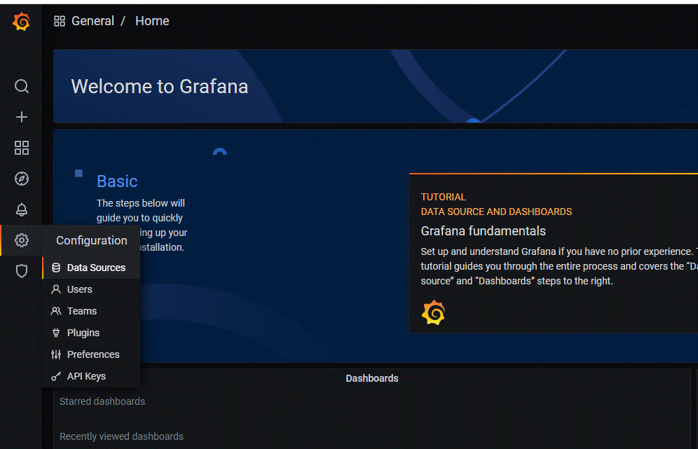
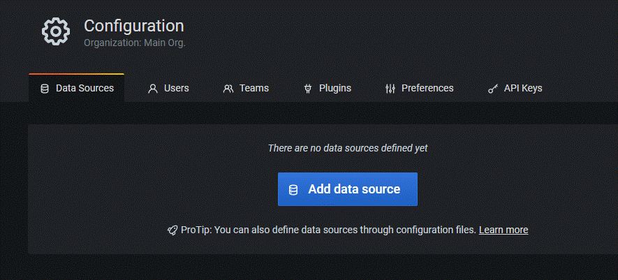
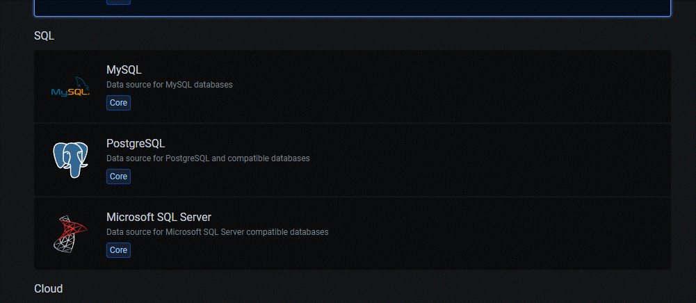
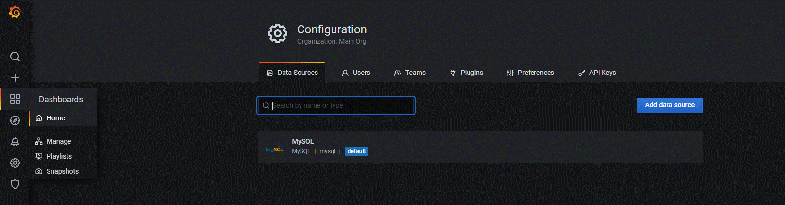
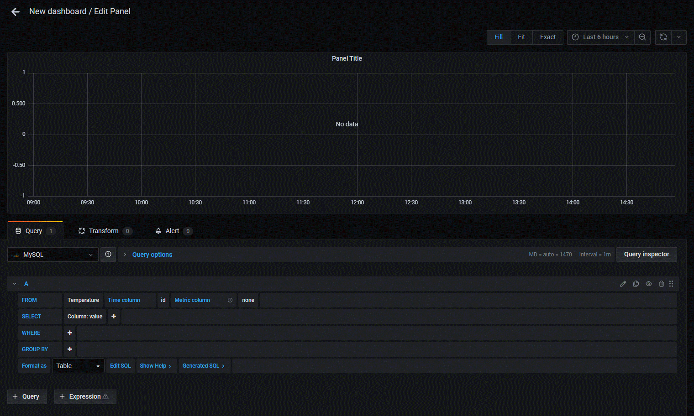
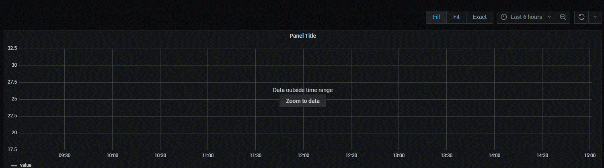

# AirLux

AirLux est une application de domotique avec une architecture complète permettant
à un utilisateur de se connecter, gérer ses appareils et accéder aux différentes
données liées à la température ou à l'humidité par exemple.


## Authors

- [@AlexisB](https://www.github.com/alexibrouard)
- [@JeremyLR](https://github.com/JeremyLRYnov)
- [@JérémyG](https://github.com/Zetsuy)
- [@EnzoP](https://github.com/DaoGod)
- [@NicolasS](https://github.com/Nicolas-3050)


# Mise en place environnement
## Installation

Dans un premier temps, pour faire fonctionner la simulation de notre architecture,
il est nécessaire de suivre plusieurs étapes clés.

### Installation Docker Desktop

#### Windows :

Téléchargez [Docker Desktop](https://desktop.docker.com/win/main/amd64/Docker%20Desktop%20Installer.exe)

#### Linux :

Suivez le guide pour l'installation de [Docker](https://docs.docker.com/engine/install/ubuntu/)

### Installation de WSL

Cliquez sur le lien [WSL](https://learn.microsoft.com/fr-fr/windows/wsl/install)

### Installation de Git Bash ou Git Desktop

#### Windows :

Cliquez sur le lien vers [Git Bash](https://git-scm.com/book/fr/v2/D%C3%A9marrage-rapide-Installation-de-Git)

Cliquez sur le lien vers [Git Desktop](https://desktop.github.com/)

#### Linux :

```bash
  $ sudo apt-get update
  $ sudo apt-get install git
```
### Utilisation du git

Pour récupérer le code à partir d'un github.

```bash 
    $ git clone URL_GitHub.com
```

Pour Commit et Push son progrès.

```bash
  $ git add Nom_Fichier
  $ git commit -m "message"
  $ git push
```

### Installation Visual Studio Code 

#### Windows & Linux

Cliquez sur le lien [VSCode](https://code.visualstudio.com/download)

### Installation des Extensions sur VSCode

- Python
- Docker

### Installation de Python sur le PC

Cliquez sur le lien [Python](https://www.python.org/downloads/)

Ne pas oublier de choisir "Add Python 3.7 to PATH (Ajouter Python 3.7 à PATH)".

## Schéma

Vous trouverez ci-dessous le schéma de l'architecture suivie concernant les
différents conteneurs ainsi que leur fonctionnement / importance.


## Docker

Pour la création d'un conteneur, il faut d'abord créer une image.
Une Image est composée de plusieurs couches empaquetant toutes les installations, dépendances, bibliothèques, processus et codes d'application nécessaires pour un environnement de conteneur pleinement opérationnel.

Ensuite il faut build cette image, ce qui créer un conteneur.

Pour la création de plusieurs conteneurs dans un seul fichier, il faut utiliser un **Docker-Compose**. 

Exemple Docker-compose : 
```yml
Service:
    redis:
        image: redis
        environment:
          - ALLOW_EMPTY_PASSWORD=yes
        volumes:
          - ./local_server:/data
        build: local_server
        ports:
          - 6379
```
Dans l'exemple ci-dessus, le service va permettre la création des conteneurs. En dessous du service, on peut voir **Image** qui va indiqué qu'elle image on va utilisé. Ensuite vu que Redis esst une base de données, on va lui demander dans l'**environement** tout les spécificités qu'on veut donner à notre conteneur. A la suite, il y a le **volume** qui va permettre le stockage de donner pour que les données soit toujours stocker même après la fermeture du conteneur. A la fin, il y a le **ports** qui va indiqué qu'elle port du conteneur sera ouvert pour de futur communication.

### Pour Build un image Docker

Pour build une image docker dans un conteneur :

```$ docker build -t nom_conteneur . ```

### Pour vérifier les conteneurs

```$ docker ps ```
Cette commande va permmtre de voir les conteneurs 

### Pour lancer un docker-compose

```$ docker-compose up -d```

Cette commande va créer les images automatiquement ensuite build ces images pour créer des conteneurs.

### Pour arrêter un docker-compose

```$ docker-compose stop ```

Cette commande va permettre d'arrêter les conteneurs créer par le docker-compose.

## Docker Desktop

Dans le docker desktop, il y a trois catégories à voir, les **Containers**, les **Images** et les **Volumes**.

- La catégorie **conteneurs** permet de visualiser les différents conteneurs qu'ils soient en marche ou non.
- La catégorie **Images** permet de visualiser les différentes images build.
- La catégorie **Voulumes** permet de vidualiser les différents espaces de stockages utiliser par les conteneurs.

## Fonctionnement de l'Architecture

Tout d'abord, notre conteneur Pulseur est composé en 3 parties:

- Un Script Python qui créer des valeurs de façon random.
- Un autre Script Python qui filtre les données pour qu'elles soit réaliste.
- Un MQTT qui permet de faire office de parsserelle pour publish les données dans le conteneur API.

Deux conteneur API qui permettent de faire la transition des données dans les différentes base de données. [Voir Schéma](#schéma)

Un conteneur Distant qui comporte 2 partie:

- Une partie qui est la base de données MySQL sur le Cloud.
- Une autre partie qui est une base de données Prometheus pour les données Times Series.

Une données Times Series se présentent sous la forme d'une suite de valeurs numériques correspondant à l'évolution d'une variable dans le temps. Dans notre cas, elle va être utile pour notre machine learning pour pouvoir faire de futur scénario.

Enfin, un dernier conteneur qui s'occupera de valider si les données dans les deux bases de données sont identique.

## Mise en place de Grafana

Tout d'abord, pour que Grafana marche, il faut lui crée un conteneur.
Nous avons décidé d'utiliser Mysql comme base de données pour se connecter à Grafana. Pour ce faire, dans le docker compose, nous avons spécifié dans son environnement les paramètres de la db Mysql.

A la suite de ça, il faut lancer les conteneurs avec la commande :

```$ docker-compose up -d```

Quand tout les conteneurs sont en marche et surtout celui de Grafana, on ouvre un navigateur et on écrit **localhost:3000** et on arrive devant une page de connexion de Grafana où on rentre les identifiants : 

User : **seillenicolas**

Password : **OAsm,5j9.nico**

Comme expliqué précedement, Grafana à besoin d'une source de données. Pour cela, il faut rajouter des données dans la base données.

### Ajout de données dans Mysql

Pour ajouter des donnnées, il faut crée les Tables de données dans Mysql.

Donc il faut aller dans le conteneur appmysql, allez à son terminal et écrire la commande :

```$ node server.js```

Ensuite, il faut allez dans le conteneur de Mysql. Dans ce conteneur, dans le terminal, on se connecte à mysql avec la commande : 

```$ mysql -h mysql -u root -p123456```  

ou

```$ mysql -u root -p```

Cela va ensuite vous demandez de rentrer le mot de passe.

A la suite de ça, on sera connecter à Mysql, cependant, il faut se connecter à la bonne base de données qui est **distant_db** mais il faut vérifier qu'elle existe en utilisant la commande :

```$ SHOW databases;```

Ensuite on se connecte :

```$ USE distant_db;```

Pour ajouter des données dans la base : 

```$ INSERT INTO Temperature VALUES(1,20);```

Cela va ajouter la valeur de 20 avec l'id 1 dans la table Temperature.

Pour vérifier les valeurs dans la table : 

```$ SELECT * FROM Temperature;```

### Utilisation de Grafana avec les données

A la suite de l'ajout de données dans la db et de la connexion à Grafana, il faut faire la connexion entre les deux.

Pour ce faire, il faut se connecter à Grafana. Quand on est connecté à Grafana avec les identifiants données précédement, on arrive dans le Dashboard.

La Data Sources, permet de préciser d'ou viennent les données :



A la suite ça, on ajoute une Data Source : 



Quand on arrive là, on choisi l'option Mysql : 



On remplit les textes pour préciser quelle base de données utilisé. Grafana va trouver la base de données car ils sont dans le même réseau avec Docker : 

Host : **mysql**

Database : **distant_db**

User : **root**

Password : **123456**

Ensuite il ne reste plus qu'à **Save & Test**.

Quand vous revenez en arrière, il faudra créer un bouveau **Dashboard**, pour cela il faut : 



Et ensuite cliquez sur **Add an empty panel**.

Maintenant vous arrivez dans le graphique.



En bas, vous voyez **FROM**, vous choississez la Table que voulez de la base de données précédement trouvé dans la Data Source.

Dans le **Time colunm**, vous choississez l'**id**.

Dans le **SELECT**, vous prenez **value**.

Dans le **Format as**, vous selectionnez **Table**.

Quand tout est fini, si des données sont existantes dans la base, il faut cliquez dans **Zoom to data**. Sinon il faudra créer manuellement des données pour tester la visualisation de données.



Nous verrons enfin le graphique des données.

on peut faire un refresh automatique des données toutes les **n secondes**.

Il ne vous reste plus qu'à **Apply** en haut à droite.

Vous pouvez enregistrer ce Dashboard pour visualiser les données à tout moment.
