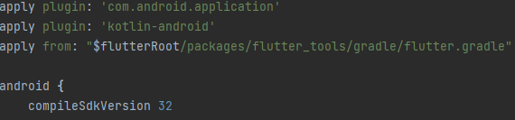

# mobileapp

application mobile du projet Airlux

## Getting Started

This project is a starting point for a Flutter application.

A few resources to get you started if this is your first Flutter project:

- [Lab: Write your first Flutter app](https://docs.flutter.dev/get-started/codelab)
- [Cookbook: Useful Flutter samples](https://docs.flutter.dev/cookbook)

For help getting started with Flutter development, view the
[online documentation](https://docs.flutter.dev/), which offers tutorials,
samples, guidance on mobile development, and a full API reference.

## Maquette

Notre Application sera diviser en plusieurs partie.

Une partie qui sera l'appairage des capteurs et des actuateurs dans l'appli.

Une partie sera le Menu Principale qui contiendra les pièces du Bâtiment ainsi que les capteur associées.

Une partie qui sera la gestion des scénarios.

Une partie sera les Settings de l'Application.

## Problème

Il peut y avoir plusieurs choses qui peuvent poser des problèmes dans l'application.

Tout d'abord, on ne peut pas lancer des conteneurs Docker et lancer l'émulateur de l'application car tout les deux utilisent l'Hyper-V (la virtualisation du PC) et que ça ne peux pas être utiliser en même temps.

Il est possible que vous n'arrivez pas à lancer l'application ou que vous rencontriez cette erreur :

Si c'est le cas :
- Vérifiez dans Settings que le chermin vers les sdk de dart et flutter est bien spécifié
- Dans \mobileapp\images\build.gradle, la version du sdk doit être à 32 
  
   
- Pensez à mettre à jour les dépendances dans pubspec.yaml
- Si ca ne marche toujours pas :
   - Mettez le projet dans le dossier AndroidStudioProject si ce n'est pas déjà le cas
   - Faites les commandes flutter clean, flutter pub get, flutter build apk --release
   - Passez à une version inférieure de gradle
   
**Aussi vérifier que toute les personnes utilisant cette application sont sur la même version de flutter et de Android Studio.**

## Lien

Pour le fonctionnement de Grafana, vous trouverez un `README` juste [ici](/Documentation/Grafana/README.md)

Pour la Documentation du Projet, vous trouverez un `README` juste [ici](/Documentation/README.md)

Pour le fonctionnement de l'ESP32, vous trouverez un `README` juste [ici](/Documentation/ESP32//README.md)

